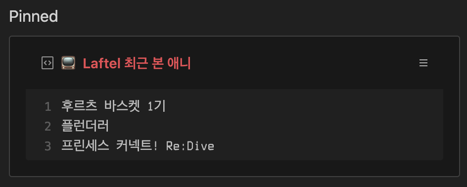

# laftel-box

Gist로 라프텔에서 최근 감상한 애니 목록을 표시해주도록 해주는 GitHub Action 입니다.

## 사용법

1. https://gist.github.com/ 에서 Public Gist를 생성한다.
1. https://github.com/settings/tokens/new 에서 Gist 권한의 토큰을 발행한다.
1. 포크 후, **Settings > Secrets**에서 secrets설정:

   - **`GH_TOKEN`**: 깃허브 토큰
   - **`GIST_ID`**: Gist ID
   - **`LAFTEL_UID`**: 라프텔 유저 ID
   - **`LAFTEL_TOKEN`**: 라프텔 유저 TOKEN

1. `.github/workflows/`에 스케쥴 파일을 설정한다.

## License

MIT
